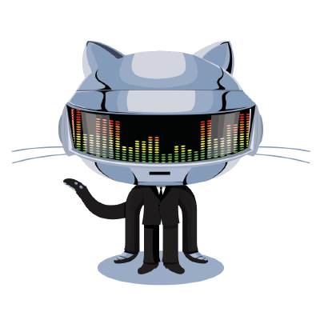
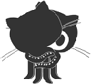
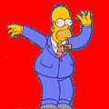
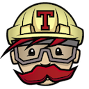

# Slack-Emojis

Some emojis I like/use.

## Table of contents:

<!-- TOC depthFrom:1 depthTo:6 withLinks:1 updateOnSave:1 orderedList:0 -->

- [Slack-Emojis](#slack-emojis)
	- [Table of contents:](#table-of-contents)
	- [Emojis](#emojis)
- [Attribution](#attribution)

<!-- /TOC -->

## Emojis

| Emoji              | Image                               |
| ------------------ | ----------------------------------- |
| Swift              |              |
| Apple              |     |
| Bob ross           |           |
| Bob ross 2         |          |
| Github-machine     |     |
| Githug             |             |
| Carlton            |            |
| Banana dance       |        |
| Doh                |                |
| Homer              |              |
| Excellent Mr Burns |  |
| Success Kid        |        |
| Mario Luigi dance  |  |
| Mario              |              |
| Travis             |           |
| Jira bug           |           |
| Jira epic          |          |
| Jira escalation    |    |
| Jira subtask       |       |
| Jira task          |          |
| Python             |             |
| Fidget             |             |

# Attribution

-   Most/all of the above are from [Slackemojis](https://slackmojis.com).
