# Slack-Emojis

[](https://github.com/kevnm67/Slack-Emojis/actions/workflows/ci.yml)
[](https://qlty.sh/gh/kevnm67/projects/Slack-Emojis)
[](https://qlty.sh/gh/kevnm67/projects/Slack-Emojis)

Emoji's commonly used for Slack, Jira, etc.

## Table of contents

<!-- TOC depthFrom:1 depthTo:6 withLinks:1 updateOnSave:1 orderedList:0 -->

- [Table of contents](#table-of-contents)
- [Updating the table](#updating-the-table)
- [Emojis](#emojis)
- [Attribution](#attribution)

<!-- /TOC -->

See the [wiki](https://github.com/kevnm67/Slack-Emojis/wiki) for architecture and setup docs.

## Updating the table

```bash
make setup   # create venv, install dev deps, install pre-commit hooks
make build   # regenerate this table from Emojis/
SLACK_TOKEN=xoxp-... make fetch  # or: .venv/bin/slack-emojis-fetch
```

[`src/slack_emojis/update_emojis.py`](./src/slack_emojis/update_emojis.py) scans the `Emojis/`
directory, sanitizes filenames to lowercase snake_case, and regenerates the table below.
[`src/slack_emojis/fetch_slack_emojis.py`](./src/slack_emojis/fetch_slack_emojis.py) pulls custom
emojis from a Slack workspace via `emoji.list`, then chains into the same regeneration.

## Emojis

| Emoji              | Preview |
| ------------------ | ------- |
| 1password |  |
| agile |  |
| android |  |
| api |  |
| apple_inc |  |
| apple_logo_classic | 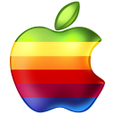 |
| aws |  |
| bananadance | 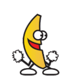 |
| bbq |  |
| bob_ross |  |
| bob_ross2 | 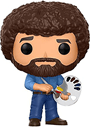 |
| carlton | 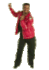 |
| circleci |  |
| circleci_fail |  |
| circleci_pass |  |
| claude |  |
| claude_code | 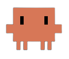 |
| claude_code_animated |  |
| claude_code_incognito | 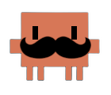 |
| claude_dancing |  |
| claude_fail | 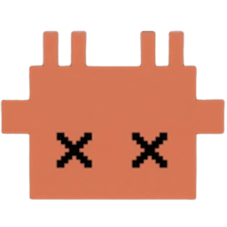 |
| claude_heart |  |
| claude_magic | 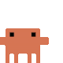 |
| claude_sob | 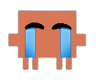 |
| clawd | 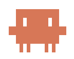 |
| database |  |
| datadog |  |
| datagrip | 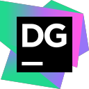 |
| delay |  |
| dev |  |
| devito |  |
| doh |  |
| dops |  |
| downvote | 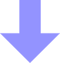 |
| excellent_mrburns | 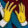 |
| fidget | 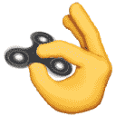 |
| figma | 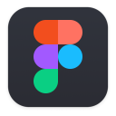 |
| fry | 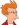 |
| ghostbusters |  |
| github |  |
| github_machine | 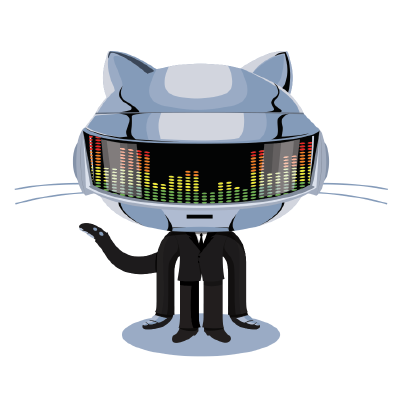 |
| github_octocat |  |
| github_octogirl | 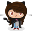 |
| githug | 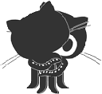 |
| grafana |  |
| hashicorp_terraform | 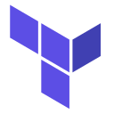 |
| homer | 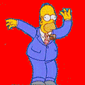 |
| im_a_developer_ralph | 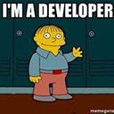 |
| jaill |  |
| jean_claude_code_van_damme | 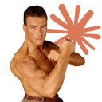 |
| jira_bug |  |
| jira_epic |  |
| jira_escalation |  |
| jira_subtask |  |
| jira_task |  |
| johnwick |  |
| johnwickq |  |
| keanu |  |
| kong_gateway |  |
| linkedin |  |
| mac_finder | 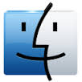 |
| magic_school_bus | 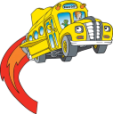 |
| mainframe | 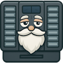 |
| mario | 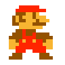 |
| mario_luigi_dance | 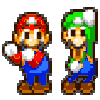 |
| new_relic |  |
| old_man_yells_at_agentforce | 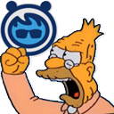 |
| old_man_yells_at_atlassian |  |
| old_man_yells_at_azure | 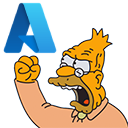 |
| old_man_yells_at_azure_devops | 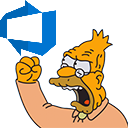 |
| old_man_yells_at_circleci |  |
| old_man_yells_at_power_bi | 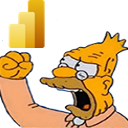 |
| old_man_yells_at_salesforce |  |
| old_man_yells_at_sentry |  |
| old_man_yells_at_xcode |  |
| petclaude | 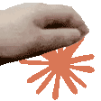 |
| photoshop |  |
| postman |  |
| powerbi |  |
| pycharm |  |
| python | 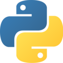 |
| salesforce |  |
| salesforce_salespoop |  |
| scrum_sprint |  |
| success_kid |  |
| swift | 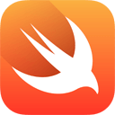 |
| ternary | 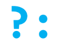 |
| terraform | 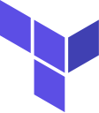 |
| thumbs_up_keanu |  |
| travisci | 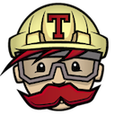 |
| ubiquiti |  |
| unifi_logo |  |
| vscode |  |
| whoa_keanu |  |
| workato | 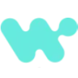 |
| xcode | 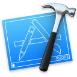 |
| xcode_explosion | 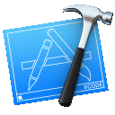 |
| xcode_project | 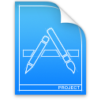 |
| zoom |  |

## Attribution

- Most/all of the above are from [Slackemojis](https://slackmojis.com).
