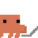
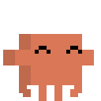
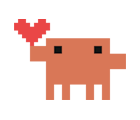
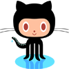
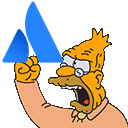
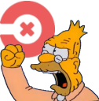
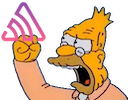
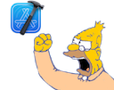

# Slack-Emojis

Emoji's commonly used for Slack, Jira, etc.

## Table of contents

<!-- TOC depthFrom:1 depthTo:6 withLinks:1 updateOnSave:1 orderedList:0 -->

- [Table of contents](#table-of-contents)
- [Updating the table](#updating-the-table)
- [Emojis](#emojis)
- [Attribution](#attribution)

<!-- /TOC -->

## Updating the table

The [python script](./scripts/update_emojis.py) will automatically generate
the readme with an updated table of emojis found in the `Emojis` directory.

## Emojis

| Emoji              | Image                               |
| ------------------ | ----------------------------------- |
| 1password |  |
| DOPS |  |
| HashiCorp Terraform |  |
| agile |  |
| android |  |
| api |  |
| apple-inc |  |
| apple-logo-classic |  |
| aws |  |
| bananadance |  |
| bbq |  |
| bob_ross |  |
| bob_ross2 |  |
| carlton |  |
| circleci-fail |  |
| circleci-pass |  |
| circleci |  |
| claude-code-incognito |  |
| claude-code |  |
| claude-code |  |
| claude-dancing |  |
| claude-fail |  |
| claude-heart |  |
| claude-magic |  |
| claude-sob |  |
| claude |  |
| clawd |  |
| database |  |
| datadog |  |
| datagrip |  |
| delay |  |
| dev |  |
| devito |  |
| doh |  |
| downvote |  |
| excellent-mrburns |  |
| fidget |  |
| figma |  |
| fry |  |
| ghostbusters |  |
| github-machine |  |
| github-octocat |  |
| github-octogirl |  |
| github |  |
| githug |  |
| grafana |  |
| homer |  |
| im_a_developer_ralph |  |
| jaill |  |
| jean-claude-code-van-damme |  |
| jira-bug |  |
| jira-epic |  |
| jira-escalation |  |
| jira-subtask |  |
| jira-task |  |
| johnwick |  |
| johnwickq |  |
| keanu |  |
| kong-gateway |  |
| linkedin |  |
| mac-finder |  |
| magic-school-bus |  |
| mainframe |  |
| mario |  |
| mario_luigi_dance |  |
| new-relic |  |
| old-man-yells-at-agentforce |  |
| old-man-yells-at-atlassian |  |
| old-man-yells-at-circleci |  |
| old-man-yells-at-salesforce |  |
| old-man-yells-at-sentry |  |
| old-man-yells-at-xcode |  |
| old_man_yells_at_azure |  |
| old_man_yells_at_azure_devops |  |
| old_man_yells_at_power_bi |  |
| petclaude |  |
| photoshop |  |
| postman |  |
| powerbi |  |
| pycharm |  |
| python |  |
| salesforce-salespoop |  |
| salesforce |  |
| scrum_sprint |  |
| success-kid |  |
| swift |  |
| ternary |  |
| terraform |  |
| thumbs-up-keanu |  |
| travisci |  |
| ubiquiti |  |
| unifi-logo |  |
| vscode |  |
| whoa_keanu |  |
| workato |  |
| xcode |  |
| xcode_explosion |  |
| xcode_project |  |
| zoom |  |

## Attribution

- Most/all of the above are from [Slackemojis](https://slackmojis.com).
